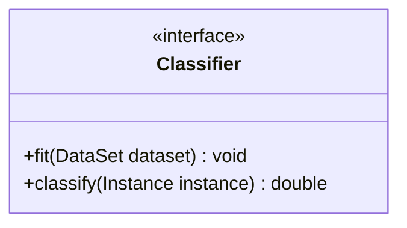
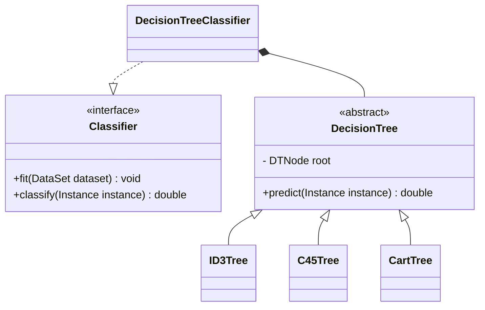
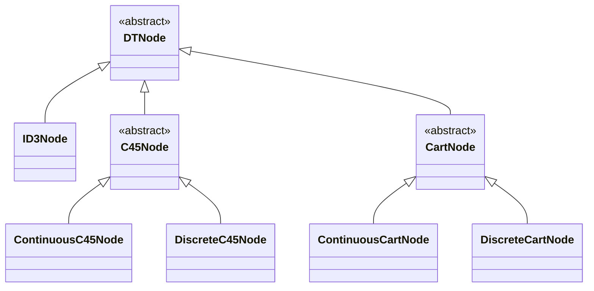
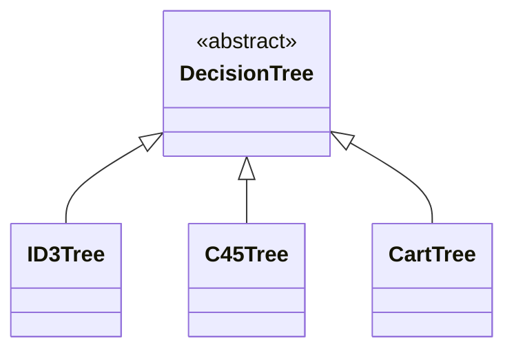
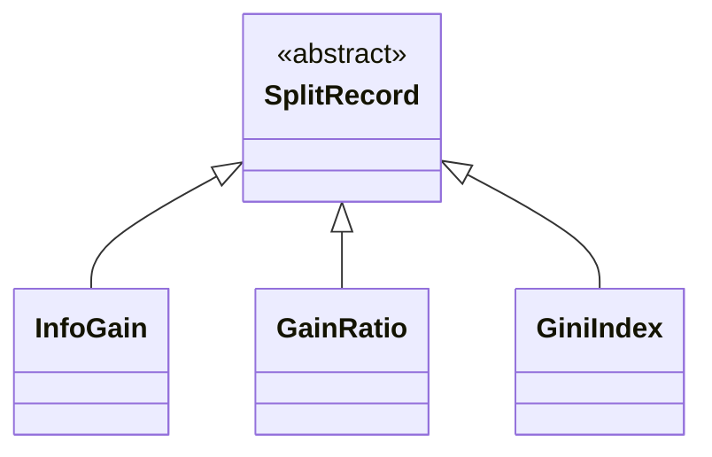
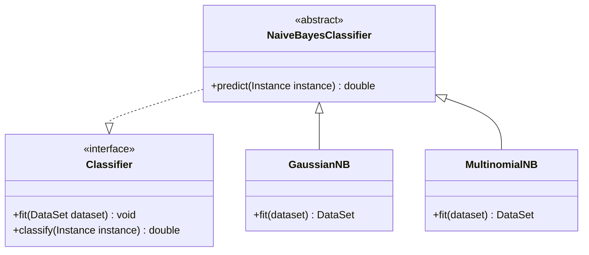
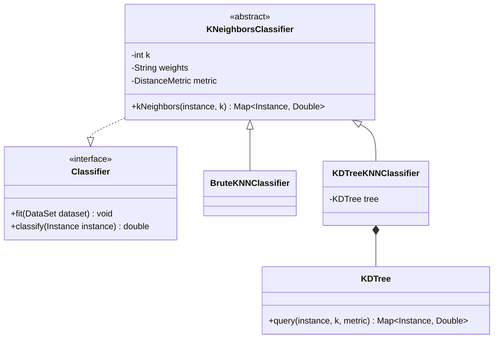

# JavaDataMining
数据挖掘算法Java实现


[API参考文档](https://cloudy1225.github.io/index.html)


## 分类 Classification

[API参考文档](https://cloudy1225.github.io/main/java/classify/package-summary.html)




### 决策树 DecisionTree

[API参考文档](https://cloudy1225.github.io/main/java/classify/decisionTree/package-summary.html)

源码：```src/main/java/classify/decisionTree```

测试：```src/test/java/classify/DecisionTreeClassifierTest.java```


实现了三种决策树构建算法：``ID3, C4.5, CART``。

其中 ``ID3Tree``只支持离散数据，``C45Tree``和``CartTree``既支持离散数据又支持连续数据，支持混合数据集。

实现的算法支持赋予训练集权重


```DecisionTree```主要暴露了两个接口：```fit(DataSet dataset); predict(Instance instance)```

```fit``` 根据训练集生成决策树，三个步骤：

1. preprocess：预处理训练集
2. buildTree：生成决策树
3. prune：后剪枝

```predict``` 预测样本的类

另外的：

**算法具体的实现都会根据样本的权重来加权计算**，故

```fit(DataSet dataset, Map<Double, Double> classWeight, double[] sampleWeight)```：支持对训练集样本设置权重，以得到更合理的模型

```print```：打印决策树

```prunedSubTrees```：返回后剪枝过程中的一系列```alpha```与子树。


#### 类的设计




决策树节点类：



- ```DTNode```：决策树节点的抽象父类，包含节点共有的属性。
- ```ID3Node```：ID3算法只支持离散特征，且可以为多叉树，故每个节点用```List```保存子节点，用```List```保存相应有向边的值。
- ```C45Node```：C4.5算法同时支持离散与连续特征，可以为多叉树，使用左孩子右兄弟表示法。对于连续特征，```ContinuousC45Node```只需保存连续特征的最佳划分点即可；对于离散特征，```DiscreteC45Node```使用```List```保存相应有向边的值。
- ```CartNode```：Cart算法同时支持离散与连续特征，只为二叉树，使用孩子表示法。对于连续特征，```ContinuousCartNode```只需保存连续特征的最佳划分点即可；对于离散特征，```DiscreteCartNode```使用两个```SortedSet```保存相应有向边的值集合。

决策树类：




- ```DecisionTree```：抽象父类，拥有用于预剪枝和后剪枝的属性：
  - ```maxDepth```：树的最大深度，默认为```Integer.MAX_VALUE```
  - ```minSamplesSplit```：允许继续划分的最小样本数，默认为```2```
  - ```minSamplesLeaf```：叶节点的最小样本数，默认为```1```，当数据集样本数小于此值时，会被置为叶节点
  - ```minImpurityDecrease```：最小不纯度降低，默认为0，即若划分后纯度提升小于此值，则不会划分
  - ```ccpAlpha```：用于代价复杂度后剪枝，默认为0，即不进行后剪枝。详见后面
- ```ID3Tree, C45Tree, CartTree``` 继承```DecisionTree```，根据相应算法，实现相应不纯度计算，特征选择，数据集划分等

特征选择结果类：



- ```SplitRecord```：抽象父类，故定义该数据结构，保存特征选择结果：被选择特征的索引及其对应的度量值等，以用于数据集的划分和树节点的构建。
- ```InfoGain, GainRatio, GiniIndex``` 继承 ```SplitRecord```，添加需要的变量如连续特征的最佳划分点等


#### 公开方法

```java
**
 * This is an abstract base class for implementing decision tree.
 * Different subclasses should implement different algorithms to build a decision tree.
 *
 * @author Cloudy1225
 * @see Evaluatable
 * @see DecisionTreeClassifier
 */
public abstract class DecisionTree implements Evaluatable, WeightHandler {
    /**
     * Constructs a decision tree with given constraint conditions.
     *
     * @param maxDepth the maximum depth of the tree
     * @param minSamplesSplit the minimum number of samples required to split an internal node
     * @param minSamplesLeaf the minimum number of samples required to be at a leaf node
     * @param minImpurityDecrease a node will be split if this split induces a decrease of the impurity greater than or equal to this value.
     * @param ccpAlpha Complexity parameter used for Minimal Cost-Complexity Pruning
     */
    public DecisionTree(int maxDepth, int minSamplesSplit, int minSamplesLeaf, double minImpurityDecrease, double ccpAlpha) {}
    
    /**
     * Builds a decision tree from the training set.
     *
     * @param dataset training set
     */
    public void fit(DataSet dataset);
    
     /**
     * Predicts the class value for given instance.
     *
     * @param instance the specified instance
     * @return class value for given instance
     * @throws EstimatorNotFittedException if this decision tree is not fitted yet
     */
    public double predict(Instance instance);
    
    /**
     * Prints this fitted decision tree.
     *
     * @throws EstimatorNotFittedException if this decision tree is not fitted yet
     */
    public void print();
    
    /**
     * Returns a sequence of effective alphas and a sequence of pruned tree correspondingly.
     *
     * @return a sequence of effective alphas and a sequence of pruned tree correspondingly
     * @throws EstimatorNotFittedException if this decision tree is not fitted yet
     */
    public Map<Double, DTNode> prunedSubTrees();
    
    /**
     * Performs cross validation with the specified parameters.
     *
     * @param dataset the data set to use in the cross validation.
     *                This data set is split in the appropriate number of folds.
     * @param k the number of folds to create
     * @return the results of the cross-validation.
     */
    @Override
    public Map<Double, PerformanceMeasure> crossValidation(DataSet dataset, int k);
}
```


#### 树的构建

##### 算法描述

```java
DTNode buildTree(DataSet dataset, int depth) {
    DTNode node;
    
    if (depth >= 最大允许深度) { // 叶节点条件1
        设置node为叶节点，类为数据集中出现最多的类;
        return node;
    }
    if (dataset中所有实例都属于同一个类C) { // 叶节点条件2
        设置node为叶节点，类为C;
        return node;
    }
    if (dataset中特征都被选择完了) { // 叶节点条件3
        设置node为叶节点，类为数据集中出现最多的类;
        return node;
    }
    if (dataset中样本数量 < 允许继续划分的最小样本数) { // 叶节点条件4
        设置node为叶节点，类为数据集中出现最多的类;
        return node;
    }
    
    //特征选择，选择可以最佳划分数据集的特征
    SplitRecord splitRecord = this.selectBestFeature(dataset);
    if (splitRecord.improvement < 最小不纯度降低) { // 叶节点条件5
        设置node为叶节点，类为数据集中出现最多的类;
        return node;
    }
    
    //根据选择的特征来划分数据集
    subDataSets = this.split(dataset, splitRecord);
    
    对每个子集进行处理，构建node的子节点: {
        if (子集样本数 < 叶节点的最小样本数) { // 叶节点条件6
            设置子节点child为叶节点，类为dataset中出现最多的类;
        } else {
            child = buildTree(subDataSet); // 递归调用
        }
        node.addChild(child); // 将子节点绑到node上
    }
    return node;
}
```


##### 预剪枝

- ```maxDepth```：树的最大深度，默认为```Integer.MAX_VALUE```

- ```minSamplesSplit```：允许继续划分的最小样本数，默认为```2```

- ```minSamplesLeaf```：叶节点的最小样本数，默认为```1```，当数据集样本数小于此值时，会被置为叶节点

- ```minImpurityDecrease```：最小不纯度降低，默认为0，即若划分后纯度提升小于此值，则不会划分

  

##### 后剪枝

最小代价复杂度剪枝：[Minimal Cost-Complexity Pruning](https://scikit-learn.org/stable/modules/tree.html#minimal-cost-complexity-pruning)

调用```DecisionTree``` 的 ```Map<Double, DTNode> prunedSubTrees()```方法，将会得到从原始树剪枝到只有一个节点的过程中```alpha```与对应的子树。


### 朴素贝叶斯 NaiveBayes

[参考文档]([main.java.classify.bayes (cloudy1225.github.io)](https://cloudy1225.github.io/main/java/classify/bayes/package-summary.html))

源码：```src/main/java/classify/bayes```

测试：```src/test/java/classify/NaiveBayesClassifierTest.java```


实现了两种算法，``GaussianNB``支持连续数据，``MultinomialNB``支持离散数据。

实现的算法支持赋予训练集权重


#### 类的设计




##### GaussianNB

极大似然估计：$P(x_i|y)=\frac{1}{\sqrt{2\pi\sigma_y^2}}\exp(-\frac{(x_i-\mu_y)^2}{2\sigma_y^2})$

处理连续特征

支持预置类概率

```java
 /**
  * Create a GaussianNB with given {@code varSmoothing}
  * and given prior probabilities of the classes.
  *
  * @param priors prior probabilities of the classes
  * @param varSmoothing portion of the largest variance of all features that is added to variances for calculation stability
  */
public GaussianNB(double[] priors, double varSmoothing) {
    this.priors = priors;
    this.varSmoothing = varSmoothing;
}
```


##### MultinomialNB

贝叶斯估计：$P(x_i|y)=\frac{N_{yi}+\alpha}{N_y+\alpha n}$

处理离散特征

支持拉普拉斯平滑以及预置类概率

```java
/**
 * Create a MultinomialNB with given {@code alpha}
 * and given prior probabilities of the classes.
 *
 * @param priors prior probabilities of the classes
 * @param alpha additive (Laplace/Lidstone) smoothing parameter
 */
public MultinomialNB(double[] priors, double alpha) {
    this.priors = priors;
    this.alpha = alpha;
}
```


#### 公开方法

```java
/**
 * Abstract base class for naive Bayes classifiers.
 *
 * @author Cloudy1225
 * @see <a href="https://scikit-learn.org/stable/modules/naive_bayes.html#">naive_bayes</a>
 */
public abstract class NaiveBayesClassifier implements Classifier, WeightHandler {
    @Override
    public void fit(DataSet dataset);
    
    @Override
    public double classify(Instance instance);
    
    /**
     * Performs classification on the test instance.
     *
     * @param instance the input instance
     * @return predicted target values
     */
    public double predict(Instance instance);
    
    /**
     * Computes the unnormalized posterior log probability of given instance.
     * I.e. ``log P(c) + log P(x|c)`` for given instance.
     *
     * @param instance the input instance
     * @return {@code Map}: key is the class, value is the posterior log probability
     */
    public abstract Map<Double, Double> jointLogLikelihood(Instance instance);
}
```


### K近邻 KNearestNeighbors

[API参考文档]([main.java.classify.neighbors (cloudy1225.github.io)](https://cloudy1225.github.io/main/java/classify/neighbors/package-summary.html))

源码：```src/main/java/classify/neighbors```

测试：```src/test/java/classify/KNeighborsClassifierTest.java```


实现了两种K近邻查找算法：暴力遍历``BruteKNNClassifier``与基于k-d 树查找``KDTreeKNNClassifier``，

二者目前只支持连续数据，实现的算法支持赋予训练集权重


#### 类的设计



#### 公开方法

```java
/**
 * Abstract base class for classifiers implementing the k-nearest neighbors vote.
 *
 * @author Cloudy1225
 */
public abstract class KNeighborsClassifier implements Classifier, WeightHandler {
    /**
     * Constructs with given parameters.
     *
     * @param k number of neighbors to use by default for kNeighbors queries.
     * @param weights weight function used in prediction. Possible values:
     *                "uniform": All points in each neighborhood are weighted equally.
     *                "distance": Weight points by the inverse of their distance.
     *                "gaussian": Weight points by standard normal distribution.
     *                "custom": weight points by the weight of each instance.
     * @param metric metric to use for distance computation
     */
    public KNeighborsClassifier(int k, String weights, DistanceMetric metric);
    
    @Override
    public void fit(DataSet dataset);
    
    @Override
    public double classify(Instance instance);
    
    /**
     * Predicts the class value for given instance.
     *
     * @param instance the specified instance
     * @return class value for given instance
     */
    public double predict(Instance instance);
    
     /**
     * Finds the K-neighbors of given instance.
     *
     * @param instance given instance
     * @param k number of neighbors to find
     * @return the K-neighbors: instance and distance
     * @throws EstimatorNotFittedException if this is not fitted yet
     */
    public abstract Map<Instance, Double> kNeighbors(Instance instance, int k);
}
```


#### 距离度量

- 实现了多种距离度量方式：欧式距离，曼哈顿距离……
- 通过构造函数传入参数``DistanceMetric metric``即可
- 默认为标准化欧式距离``SEuclideanDistance``: $d = \sqrt{\sum_i\frac{(x_i - y_i)^2}{Variance_i}}$
- 允许自定义距离，实现接口``DistanceMetric``中的``measure``方法即可


#### 分类决策

- 多数表决规则，但允许设置权重
- 通过构造函数传入参数``String weights``即可
- ``weights``可选值：
  - ``“distance”``：默认参数，权重为每个邻居距离的倒数，距离越远，权重越低，影响越小，即越相似影响越大
  - ``“uniform”``：每个邻居的权重都相等，为 1 
  - ``“gaussian”``：权重为$\frac{1}{\sqrt{2\pi}}e^{-\frac{d_i^2}{2}}$，权重越低，影响越小，即越相似影响越大
  - ``“custom”``：自定义权重，在``fit``之前即为数据集中的每个``instance``设置权重，计算时直接``instance.getWeight()``


#### KDTree

##### 树的构建

每次选择划分维度时选择方差最大的维度，而不是从0维度依次选取

##### K近邻搜索

利用``PriorityQueue`` 大顶堆保存邻居，利用``ArrayDeque``栈进行递归回溯查询。

算法描述参见：[kd树算法原理详解及C++实现](https://blog.csdn.net/qq_29923461/article/details/119204500)
