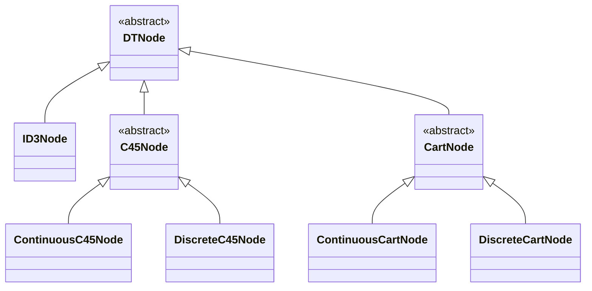
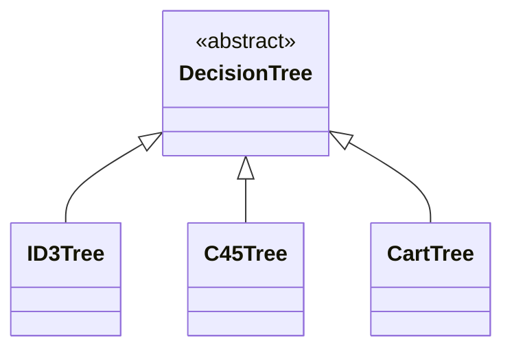
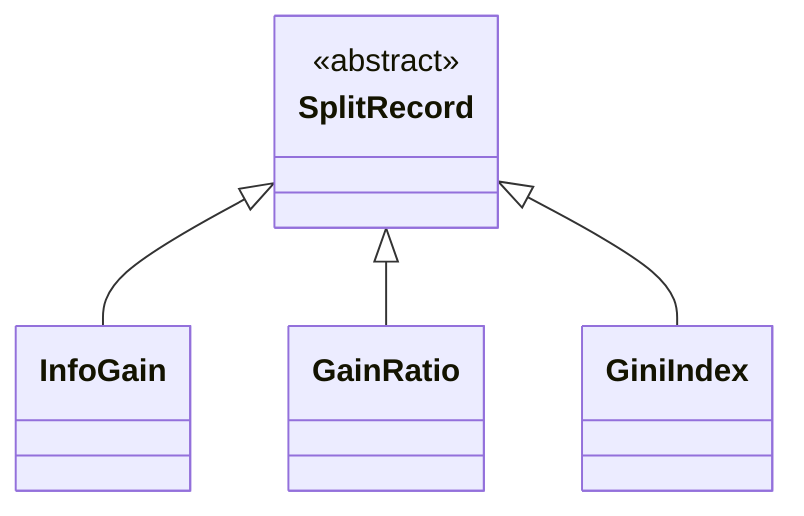
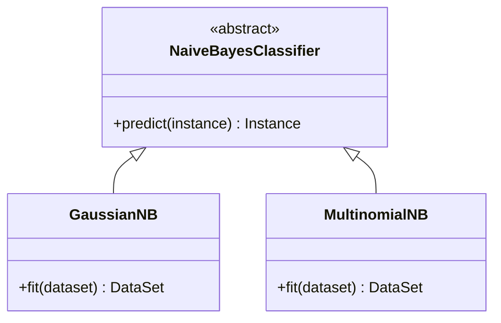

# JavaDataMining
数据挖掘算法Java实现


[API参考文档](https://cloudy1225.github.io/index.html)


### 决策树 DecisionTree

[API参考文档](https://cloudy1225.github.io/main/java/classify/decisionTree/package-summary.html)

源码：```src/main/java/classify/decisionTree```

测试：```src/test/java/classify/DecisionTreeClassifierTest.java```


```DecisionTree```主要暴露了两个接口：```fit(DataSet dataset); predict(Instance instance)```

```fit``` 根据训练集生成决策树，三个步骤：

1. preprocess：预处理训练集
2. buildTree：生成决策树
3. prune：后剪枝

```predict``` 预测样本的类

另外的：

**算法具体的实现都会根据样本的权重来加权计算**，故

```fit(DataSet dataset, Map<Double, Double> classWeight, double[] sampleWeight)```：支持对训练集样本设置权重，以得到更合理的模型

```print```：打印决策树

```prunedSubTrees```：返回后剪枝过程中的一系列```alpha```与子树。


#### 类的设计

决策树节点类：



- ```DTNode```：决策树节点的抽象父类，包含节点共有的属性。
- ```ID3Node```：ID3算法只支持离散特征，且可以为多叉树，故每个节点用```List```保存子节点，用```List```保存相应有向边的值。
- ```C45Node```：C4.5算法同时支持离散与连续特征，可以为多叉树，使用左孩子右兄弟表示法。对于连续特征，```ContinuousC45Node```只需保存连续特征的最佳划分点即可；对于离散特征，```DiscreteC45Node```使用```List```保存相应有向边的值。
- ```CartNode```：Cart算法同时支持离散与连续特征，只为二叉树，使用孩子表示法。对于连续特征，```ContinuousCartNode```只需保存连续特征的最佳划分点即可；对于离散特征，```DiscreteCartNode```使用两个```SortedSet```保存相应有向边的值集合。

决策树类：




- ```DecisionTree```：抽象父类，拥有用于预剪枝和后剪枝的属性：
  - ```maxDepth```：树的最大深度，默认为```Integer.MAX_VALUE```
  - ```minSamplesSplit```：允许继续划分的最小样本数，默认为```2```
  - ```minSamplesLeaf```：叶节点的最小样本数，默认为```1```，当数据集样本数小于此值时，会被置为叶节点
  - ```minImpurityDecrease```：最小不纯度降低，默认为0，即若划分后纯度提升小于此值，则不会划分
  - ```ccpAlpha```：用于代价复杂度后剪枝，默认为0，即不进行后剪枝。详见后面
- ```ID3Tree, C45Tree, CartTree``` 继承```DecisionTree```，根据相应算法，实现相应不纯度计算，特征选择，数据集划分等

特征选择结果类：



- ```SplitRecord```：抽象父类，故定义该数据结构，保存特征选择结果：被选择特征的索引及其对应的度量值等，以用于数据集的划分和树节点的构建。
- ```InfoGain, GainRatio, GiniIndex``` 继承 ```SplitRecord```，添加需要的变量如连续特征的最佳划分点等


#### 树的构建

##### 算法描述

```java
DTNode buildTree(DataSet dataset, int depth) {
    DTNode node;
    
    if (depth >= 最大允许深度) { // 叶节点条件1
        设置node为叶节点，类为数据集中出现最多的类;
        return node;
    }
    if (dataset中所有实例都属于同一个类C) { // 叶节点条件2
        设置node为叶节点，类为C;
        return node;
    }
    if (dataset中特征都被选择完了) { // 叶节点条件3
        设置node为叶节点，类为数据集中出现最多的类;
        return node;
    }
    if (dataset中样本数量 < 允许继续划分的最小样本数) { // 叶节点条件4
        设置node为叶节点，类为数据集中出现最多的类;
        return node;
    }
    
    //特征选择，选择可以最佳划分数据集的特征
    SplitRecord splitRecord = this.selectBestFeature(dataset);
    if (splitRecord.improvement < 最小不纯度降低) { // 叶节点条件5
        设置node为叶节点，类为数据集中出现最多的类;
        return node;
    }
    
    //根据选择的特征来划分数据集
    subDataSets = this.split(dataset, splitRecord);
    
    对每个子集进行处理，构建node的子节点: {
        if (子集样本数 < 叶节点的最小样本数) { // 叶节点条件6
            设置子节点child为叶节点，类为dataset中出现最多的类;
        } else {
            child = buildTree(subDataSet); // 递归调用
        }
        node.addChild(child); // 将子节点绑到node上
    }
    return node;
}
```


##### 预剪枝

- ```maxDepth```：树的最大深度，默认为```Integer.MAX_VALUE```

- ```minSamplesSplit```：允许继续划分的最小样本数，默认为```2```

- ```minSamplesLeaf```：叶节点的最小样本数，默认为```1```，当数据集样本数小于此值时，会被置为叶节点

- ```minImpurityDecrease```：最小不纯度降低，默认为0，即若划分后纯度提升小于此值，则不会划分

  

##### 后剪枝

最小代价复杂度剪枝：[Minimal Cost-Complexity Pruning](https://scikit-learn.org/stable/modules/tree.html#minimal-cost-complexity-pruning)

调用```DecisionTree``` 的 ```Map<Double, DTNode> prunedSubTrees()```方法，将会得到从原始树剪枝到只有一个节点的过程中```alpha```与对应的子树。


### 朴素贝叶斯 NaiveBayes

[参考文档]([main.java.classify.bayes (cloudy1225.github.io)](https://cloudy1225.github.io/main/java/classify/bayes/package-summary.html))

源码：```src/main/java/classify/bayes```

测试：```src/test/java/classify/NaiveBayesClassifierTest.java```


#### 类的设计




##### GaussianNB

极大似然估计：$P(x_i|y)=\frac{1}{\sqrt{2\pi\sigma_y^2}}\exp(-\frac{(x_i-\mu_y)^2}{2\sigma_y^2})$

处理连续特征


##### MultinomialNB

贝叶斯估计：$P(x_i|y)=\frac{N_{yi}+\alpha}{N_y+\alpha n}$

处理离散特征
